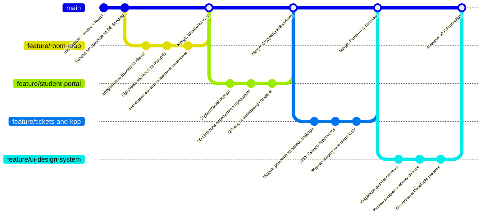
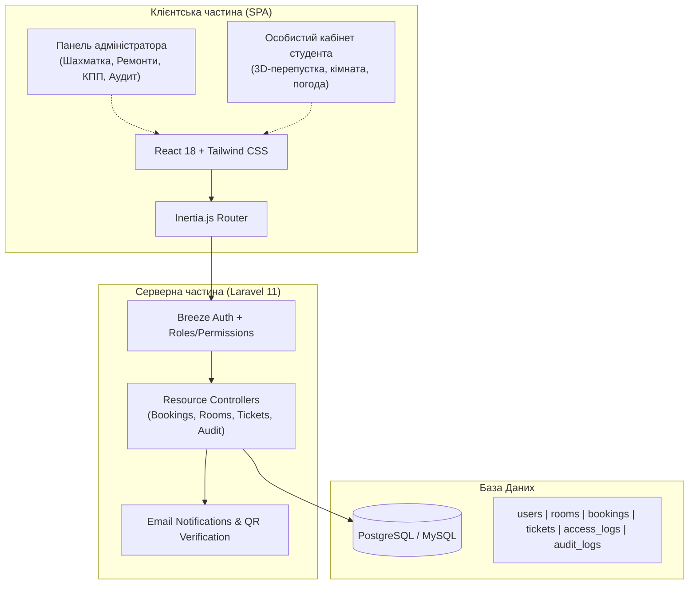

# 🏢 Історія Розробки: Інформаційна Система «МНАУ Гуртожитки»
> **Презентаційний документ для Obsidian & демонстрації проєкту**  
> *Дата створення:* Вересень 2026 | *Загальна кількість комітів:* **151+** | *Стек:* Laravel 11, Inertia.js, React 18, Tailwind CSS

---

## 📊 Загальна статистика проєкту

| Показник | Значення | Опис |
| :--- | :--- | :--- |
| **Всього комітів** | **151** | Повна безперервна історія розробки |
| **Основні модулі** | **8** | Шахматка, Заявки, Ремонти, Студенти, КПП, Оголошення, Аудит, Довідники |
| **Архітектура** | **Fullstack SPA** | Laravel 11 API + React/Inertia.js (Single Page Application) |
| **Підтримка тем** | **100%** | Повна адаптація Light & Dark Mode |
| **Локалізація** | **Українська (100%)** | Інтерфейс, повідомлення, аудит подій |

---

## 🌳 Граф еволюції розробки (Mermaid GitGraph)

> [!tip] Відображення в Obsidian
> Цей блок автоматично візуалізується в Obsidian як інтерактивне дерево комітів та гілок.

---

## 🚀 7 Ключових Етапів (Milestones) Проєкту

### 1. 🏗️ Фундамент та Архітектура (Липень 2026)
* **Головна мета**: Створення надійної архітектури системи з розділенням ролей (Адміністратор, Комендант, Студент).
* **Ключові коміти**:
  - `e4c9f15`: Initialize Laravel hostel management application with authentication, models, Inertia frontend.
  - `684a17e`: Mandatory password & profile update enforcement, batch generation tools.
  - `81e4626`: Initial dark mode support with persistent theme toggle.
* **Технічні рішення**:
  - Безшовна взаємодія бекенду й фронтенду завдяки **Inertia.js** (без необхідності писати зайві REST API контролери для кожної дії).
  - Глобальна система захисту та прав доступу (Middlewares, Policies).

---

### 2. 🏢 Інтерактивна Шахматка Кімнат (Липень — Вересень 2026)
* **Головна мета**: Візуальне керування номерним фондом гуртожитків в один клік.
* **Ключові коміти**:
  - `dc86f46`: Rooms, floors, buildings management with default capacity setting.
  - `50fbf9e`: Gender conflict validation and mixed-room intelligence.
  - `9b1d9bc`: Separate occupancy filter with free beds option & enhanced toolbar.
  - `565bd52`: Unify specialties into single interactive card.
* **Технічні переваги**:
  - Миттєва фільтрація за курсами (1-4 курс), спеціальностями (ПВ, ФК, АІ, МЕН тощо) та вільними ліжками.
  - Кольорове кодування карток резидентів із бейджами статі, курсу та групи.

---

### 3. 📱 Мобільний та Студентський Портал (Вересень 2026)
* **Головна мета**: Сучасний особистий кабінет студента, адаптований під смартфони.
* **Ключові коміти**:
  - `1a82e59`: Digital student pass modal with 3D tilt, live QR code & gyroscope reaction.
  - `cb13d35`: Performance optimization for mobile digital pass, zero-lag 60fps load.
  - `83de741`: Live Mykolaiv weather & clock widget, vibrant Aurora glow mesh.
  - `5235461`: Contextual layout for settled vs new students, roommate hub.
* **Фішки, які вражають аудиторію**:
  - **Цифрова 3D-перепустка**: реагує на нахил телефону через Sensor API, створюючи ефект фізичної голографічної пластикової карти.
  - **Інтеграція погоди**: віджет погоди в Миколаєві через Open-Meteo API з кешуванням.

---

### 4. 🔧 Модуль Технічних Заявок (Ремонти)
* **Головна мета**: Спростити комунікацію між мешканцями та комендантом/майстрами щодо поломок.
* **Ключові коміти**:
  - `64853a2`: Upgrade TicketsTab with interactive KPI stats, instant search, relative timestamps.
  - `7e5b2b5`: Zero layout-jump on resolve confirmation, smooth animations, prominent contact button.
  - `f509716`: Design polish for dark & light themes.
* **Особливості**:
  - Швидке двокрокове підтвердження виконання («Підтвердити? Так / Ні») без модальних вікон.
  - Автоматичний розрахунок KPI (Потребують виконання, Успішно вирішено, Всього звернень).

---

### 5. 🛡️ Безпека, КПП та Аудит-Лог
* **Головна мета**: Повний цифровий контроль за відвідуваністю та безпекою гуртожитку.
* **Ключові коміти**:
  - `3046b92`: Dynamic year order generation, auto-fill current year prefix, live QR verification.
  - `a502a32`: Overhaul audit logs tab with KPIs, categories, humanized badges & CSV export.
  - `fa3de2f`: Soft colorful haze for audit rows, 100% Ukrainian localized action labels.
* **Функціонал**:
  - Сканер перепусток КПП у реальному часі (Вхід / Вихід).
  - Експорт журналу дій у CSV для звітності керівництва.
  - Візуальна кольорова димка дій (зелена — успіх/поселення, синя — оновлення, бурштинова — КПП, червона — виселення/скасування).

---

### 6. 💬 Інтегрована Система Зв'язку зі Студентом
* **Головна мета**: Миттєвий контакт адміністратора чи коменданта з мешканцем.
* **Ключові коміти**:
  - `d9d63ba`: Direct student contact modal with Telegram, phone, and direct email broadcast.
  - `7efb9cd`: Standardize unified button design system (`Зв'язок`) across all tabs.
* **Канали зв'язку**:
  - Швидкий перехід у Telegram за нікнеймом.
  - Прямий виклик за номером телефону або копіювання в буфер.
  - Відправка офіційного email-повідомлення прямо з адмін-панелі.

---

### 7. 🎨 Єдина Дизайн-Система (Design System & Micro-UX)
* **Головна мета**: Професійний преміальний вигляд кожного пікселя сайту.
* **Ключові коміти**:
  - `7efb9cd`: Unified button tokens, clean SVG iconography, standard spacing across all 10 tabs.
  - `10b8010`: Polished custom select dropdowns with absolute SVG arrows.
  - `2aa28dd`: Zero-emoji UI, replaced with crisp scalable vector icons.
* **Дизайн-токен кнопки**:
  - Радіус: `rounded-xl`
  - Падінг: `px-3 py-1.5`
  - Шрифт: `text-xs font-bold`
  - Мікро-анімація: `active:scale-95 transition-all shadow-2xs`

---

## 🏛️ Схема Архітектури Системи (Mermaid Diagram)

---

## 💡 Поради для презентації / захисту проєкту

1. **Почніть із проблеми**: «Ручний облік у журналах, складнощі з переселенням та відсутність швидкого зв'язку зі студентами».
2. **Покажіть Шахматку в живу**: продемонструйте швидку фільтрацію за курсами/спеціальностями та статус вільних місць.
3. **Зробіть акцент на 3D-перепустці**: відкрийте кабінет студента на телефоні та повертіть його перед комісією — інтерактивний гіроскоп викликає вау-ефект.
4. **Покажіть журнал Аудиту та експорт**: продемонструйте, що кожен крок коменданта та студента протоколюється і може бути експортований у CSV для звіту деканату.
